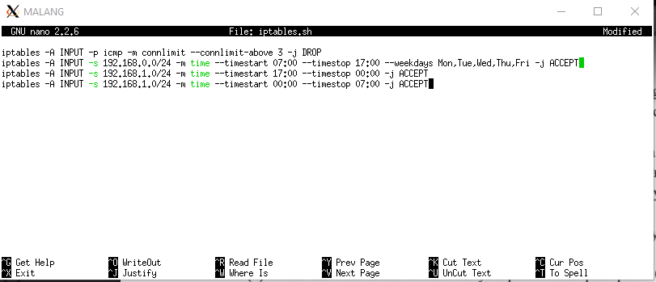

# Jarkom_Modul5_Lapres_D02
## Laporan Resmi Praktikum Modul 5 Jaringan Komputer 2020
**Kelompok D02**

-Calvin Wijaya 05111840000086

-Alie Husaini R. 05111840000097

### Konfigurasi VLSM

##### 1. Mengkonfigurasi SURABAYA menggunakan iptables, namun bukan menggunakan MASQUERADE.

##### 2. Mendrop semua akses SSH dari luar topologi pada server yang memiliki IP DMZ pada SURABAYA.

##### 3. Membatasi DHCP dan DNS server dengan hanya boleh menerima 3 koneksi ICMP pada saat bersamaan.

##### 4. Akses dari subnet SIDOARJO hanya diperbolehkan pada pukul 07.00 - 17.00 pada hari Senin sampai Jumat.
##### 5. Akses dari subnet GRESIK hanya diperbolehkan pada pukul 17.00 hingga pukul 07.00 setiap harinya.

##### 6. SURABAYA disetting sehingga setiap request dari client yang mengakses DNS Server akan didistribusikan secara bergantian pada PROBOLINGGO port 80 dan MADIUN port 80.

##### 7. Semua paket didrop oleh firewall (dalam topologi) tercatat dalam log pada setiap UML yang memiliki aturan drop.

